<<<<<<< HEAD
# Block 3: Course Setup Instructions

## Part 1: Setup Git Repository:

1) Login to your github account associated with the course: https://github.com/UTSW-Software-Engineering-Course-2024
2) Make a new repository for this week: https://github.com/organizations/UTSW-Software-Engineering-Course-2024/repositories/new
    * Recommended: Follow naming conventions: (i.e. Block3_INSERT_YOUR_NAME_HERE)
3) Copy the associated git HTTPS link to somewhere you can find it:
    * ex: https://github.com/UTSW-Software-Engineering-Course-2024/Block3_INSERT_YOUR_NAME_HERE.git

    **IMPORTANT:** Ensure you copy the HTTPS link; not the SSH link (ssh link looks like git@xxxxx).
4) If you do not yet have a personal access token associated with your git account, follow these instructions to create one. O/w skip to step 5

### Git personal access token:
Assuming you are logged into your git account:

4.1) Settings:

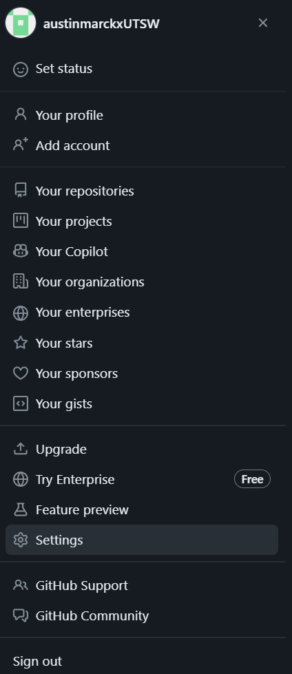 

4.2) Developer Settings:

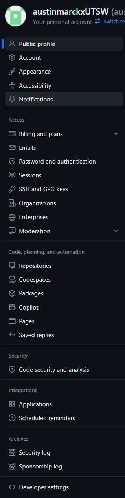 

4.3) Personal access tokens --> tokens (classic):

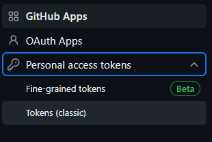 

4.4) Generate new token (classic):
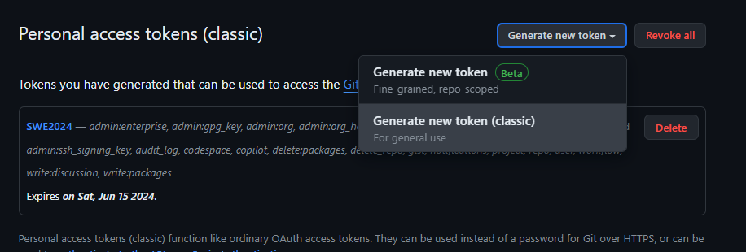

4.5) Click generate token:

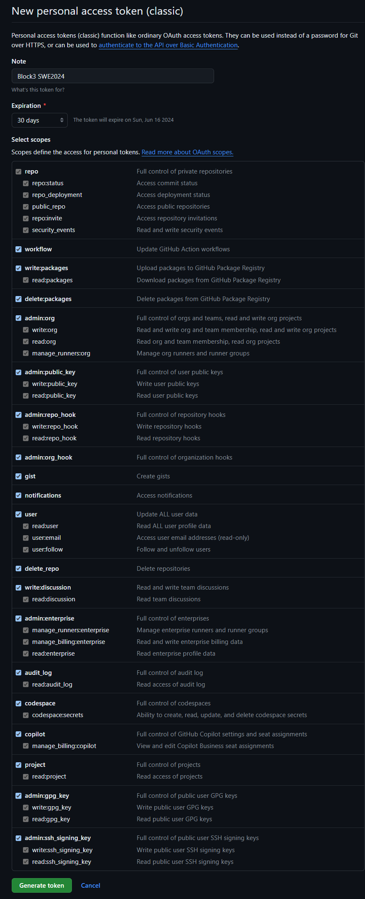
Make a name for your token, and set an expiration date if you desire a shorter/longer token life. 
You could be more selective with the scopes you select, but I'd recommend just selecting them all unless you know what you're doing.

**IMPORTANT:** Ensure you copy the token and save somewhere easy to access

5) Ensure you have your assigned training account, password, and node (See Aixa's communication)

### Part 1: Summary
Personal recommendation is to have the following information saved somewhere very easy to access (such as .txt on desktop)
key | value | notes 
 --- | --- | ---  
Node | 172.18.227.xx | Where xx is your assigned node
Account | trainXX    |where xx is your assigned training account
Password |        | ... (you get the idea)
github_username |       | github username assigned with course - you will need to enter this every pull / push you make 
github_token    |       | the personal access token (instructions above) - you will need to enter this every pull / push you make
github_https_upstream | https://github.com/UTSW-Software-Engineering-Course-2024/Block3_INSERT_YOUR_NAME_HERE.git | 

## Part 2: Web Desktop & Node Access

1) Go to the biohpc and login to your training account: https://portal.biohpc.swmed.edu/content/
2) Go to webdesktop page:
   * GUI: "cloud services" --> "Web Desktop"
   * Link: https://portal.biohpc.swmed.edu/intranet/terminal/webdesktop/
3) Launch a new webdesktop session on your appointed node:
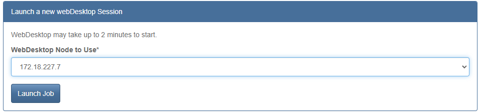 

Once launched, you should see something like this: 
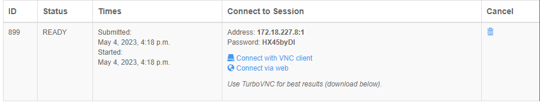 

4) Click connect with VNC client.  A download should start automatically. Once complete, click the download file.
     ○ If you haven't downloaded VNC, there is a link appropriate for your OS above the webdesktop session box
  
  If you prefer, you can work on the browser window, but working through VNC is recommended.

5) Login to the node using the same training account username and password

Upon login you should see somethign like this:
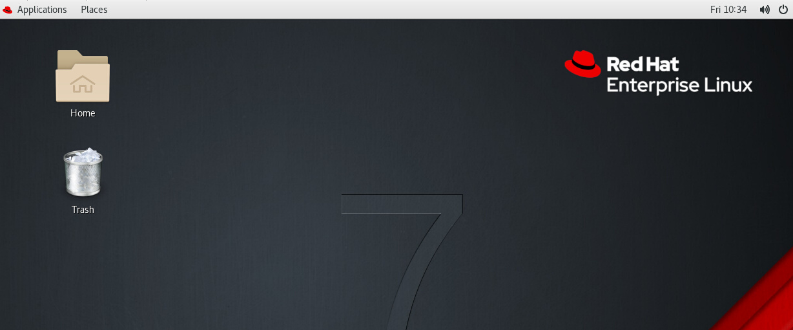

6) Navigate to and open the terminal
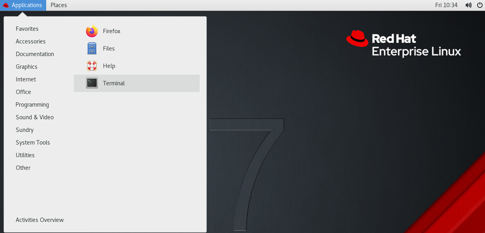

### Part 2: Summary
If all the above steps were completed correctly, you should be logged into your assigned training account, have a webdesktop session on your assigned node, and have the terminal open on your GUI.

It should looks something like this: 
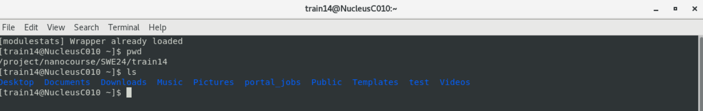

## Part 3: Cloning lectures and assignments:

1) Begin by cloning the course materials from the following link: https://github.com/UTSW-Software-Engineering-Course-2024/Block3Materials.git
> git clone https://github.com/UTSW-Software-Engineering-Course-2024/Block3Materials.git

You will be prompted to enter your github username (which you conveniently have at hand from part 1) and press ENTER.
The password will be the github token (which you also conveniently have at hand from part 1). press ENTER 
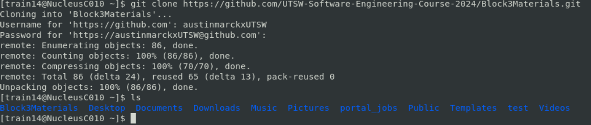

2) Change directories into the cloned repository and set the remote origin to **YOUR** github repo created in part 1.
> cd Block3Materials
> 
> git remote set-url origin https://github.com/UTSW-Software-Engineering-Course-2024/Block3_INSERT_YOUR_NAME_HERE.git
> 
> \# (optional) You can check to make sure this worked by:
> 
> git remote -v

If you perform the optional step you should see:
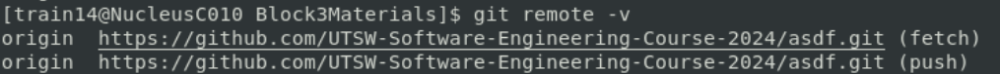

3) Push the cloned environment to your repo:
> git branch -M main
> 
> git push -u origin main
> 
> \# Username prompt
> 
> \# git-token prompt

### Part 3: Summary
At this point you should have a copy of all the materials from the course that have been provided at this time. Over the course of the week, we will add additional files to the repository. 

In order to get the most updated files you can:
> git remote set-url origin https://github.com/UTSW-Software-Engineering-Course-2024/Block3Materials.git
> 
> git pull
> 
> \# Username prompt
> 
> \# git-token prompt
> 
> git remote set-url origin https://github.com/UTSW-Software-Engineering-Course-2024/Block3_INSERT_YOUR_NAME_HERE.git
> 
> git remote -v

## Part 4: Conda Environment Setup:

There are 3 conda environments that we have already created for you that you will use for the exercises in this block.

1) In the terminal, cd into the Block3Materials folder and Execute the following commands:
> source installWeekendEnv.sh
> 
> source installVAEGANEnv.sh
> 
> source installVAEGAN_PyTorch.sh

Each of these commands will take a few seconds to execute.

2) You will need to activate each conda environment with the provided scripts: 

Environment Name | Command | Domain 
--- | --- | ---  
Nanocourse2022TF_new | source activateWeekendEnv_new.sh | Used only for exercises over the weekend. 
VAE_GAN_env_new | source activateVAEGANEnv.sh | Used only for almost all excercises next week. 
VAE_GAN_PyTorch | source activateVAEGAN_PyTorch.sh | Used only for pytorch notebook.

You can deactivate any conda environment using: 
> conda deactivate

3) VSCode
The IDE for this week will be VSCode which BioHPC already has installed as a module. In order to load this, execute the following commands:
> module load vscode
> 
> code .
> 

This will both load the latest version of vscode available and start vscode in your current directory 

4) VSCode: Python and Jupyter Extensions

Upon loading VSCode you may see notifications pop up in the bottom right hand corner asking if you want to install python and jupyter extensions. You will want to install the recommended extensions from this notification. If you don't see this, the extensions may have already been installed. Navigate to the extensions page and check to make sure the following extensions are installed and enabled:

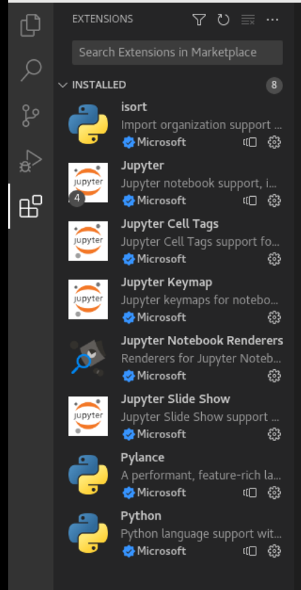

5) Selecting the Kernel for VSCode Jupyter environment

Navigate back to the file explorer and from Block3Materials open the following file: ./tasks/OOP/OOP_in_Python.ipynb

In the top right hand corner you should see a python version (shown in image below). Change this to the appropriate conda environment which you just activated.

**IMPORTANT** you will need to activate the conda environment before opening vscode for the kernel to register properly.  If you don't see the kernel in the drop down menu, give it a few seconds and a couple tries; but if nothing appears, double check that your environment is active in the terminal.

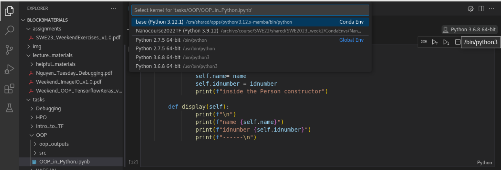

### Part 4: Summary

You are now ready to complete the tasks for this block of the assignment! Putting it all together, your console might look something like this:

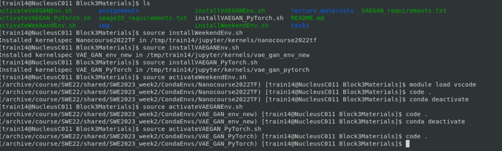
